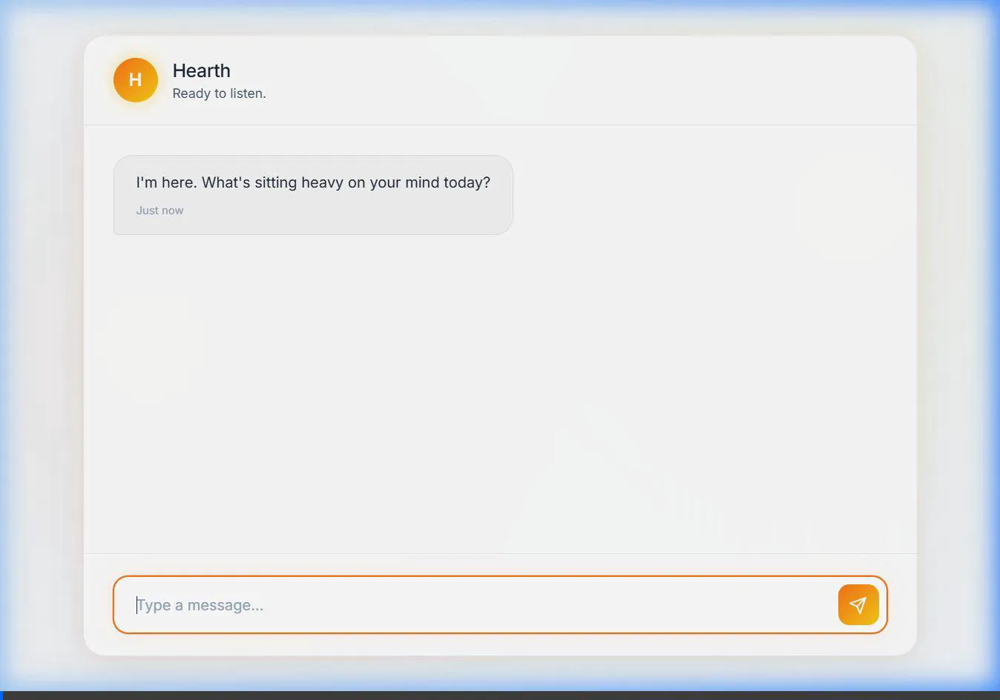

<div align="center">
  
  <h1>Hearth Companion</h1>
  <p><b>An emotionally intelligent AI companion designed to provide grounded, non-clinical support.</b></p>
  
  <p>
    <a href="https://github.com/Mrun25/Hearth_Emotional-Companion/actions"></a>
    <a href="https://github.com/Mrun25/Hearth_Emotional-Companion"></a>
    <a href="https://github.com/Mrun25/Hearth_Emotional-Companion/blob/main/LICENSE"></a>
  </p>
</div>

---

## 📖 Overview

Hearth is an emotionally intelligent AI companion featuring an **Agentic Self-Correction Loop**, lightning-fast inference via Groq, and a modern glassmorphic web interface. It acts as a grounded conversational companion, ensuring it doesn't give unwanted advice or psychoanalyze the user.

---

## ✨ Features

- **Agentic Self-Correction (Internal Monologue)**: The backend runs an internal "Draft -> Critic -> Refine" loop. An independent QA Critic evaluates Fumii's drafts against strict empathetic rules and forces rewrites until the response is perfect.
- **Crisis Detection**: Parallel DistilBERT crisis classifier monitors for distress signals without baking it into the LLM logic.
- **Modern Web UI**: A beautiful, premium chat interface (`hearth_chat_interface.html`) featuring dark/light modes, micro-animations, and glassmorphism.
- **In-Context Fine-Tuning**: Highly optimized system prompts that override the base model's "helpful assistant" persona.
- **Fast Inference**: Powered by Groq (`llama-3.3-70b-versatile`) for instant responses.

---

## 🎥 Product Demo

Watch Hearth in action, demonstrating the Agentic Loop actively responding to an emotionally heavy prompt.

<div align="center">
  
</div>

---

## 🛠 Repository Architecture

The project follows a standard Python project architecture, cleanly separating core components, utilities, and assets.

```text
Hearth/
├── assets/                    # Project logos, diagrams, and demo recordings
├── src/                       # Application code
│   ├── api.py                 # Flask backend running the Agentic Evaluator Loop + UI serving
│   ├── inference.py           # Core model inference logic
│   ├── crisis_classifier.py   # DistilBERT crisis detector module
│   └── fumii_constants.py     # Prompt templates and global rules
├── frontend/                  
│   └── hearth_chat_interface.html # The modern frontend chat interface
├── scripts/                   # Utilities, training, and data preparation
│   ├── fetch_responses.py     
│   ├── mistral_api_finetune.py
│   ├── prepare_data.py        
│   └── train.py               
├── pipeline/                  # Model evaluation pipeline (scorer, config)
├── tests/                     # Pytest suite
├── docs/                      # Agent Skills and Architecture documentation
│   └── ARCHITECTURE.md        # System flow diagrams and component logic
├── data/                      # Raw and processed datasets
├── configs/                   # Hyperparameters (LoRA + training)
├── .env.example               # Environment template (API Keys)
└── requirements.txt
```

For more detailed diagrams on how Hearth works under the hood, see [ARCHITECTURE.md](docs/ARCHITECTURE.md).

---

## 🚀 Quick Start (Running the App)

### 1. Install dependencies

```bash
pip install -r requirements.txt
```

### 2. Set up API Keys

Create a `.env` file in the root directory and add your Groq API key:
```env
GROQ_API_KEY=gsk_your_key_here
```

### 3. Start the Backend Server

```bash
python src/api.py
```

### 4. Open the Interface
Navigate to [http://127.0.0.1:5000/](http://127.0.0.1:5000/) in your web browser. 
*(If you keep your terminal open, you can watch the Agentic Critic grading Hearth's drafts in real-time when you send a message!)*

---

## 🧠 The Agentic Loop Rules

The internal Critic ruthlessly enforces the following rules before allowing a message to reach the user:
1. **EXTREMELY SHORT**: Maximum 1-2 short sentences. No paragraphs.
2. **ZERO ADVICE**: No solutions, tips, or "fix-it" statements.
3. **NATURAL HUMAN FLOW**: No robotic or "point-manner" statements. 
4. **NO DRAMA**: Keep it grounded and raw. No cliches like "the weight of the world".
5. **NO AI APOLOGIES**: No "I'm sorry" or "As an AI".
6. **NO PSYCHOANALYZING**: If the user is vague (e.g. "I am lost"), Hearth must not assume why or analyze them. It must just provide a safe space ("That must be heavy. Tell me more.").

---

## 🔬 Fine-Tuning (Advanced)

If you want to bake the persona permanently into weights rather than relying entirely on the Agentic prompt loop, you have two options:

**Option A: Cloud Fine-Tuning (No GPU Required)**
1. Run `python scripts/prepare_data.py`
2. Run `python scripts/mistral_api_finetune.py` (Requires `MISTRAL_API_KEY`)

**Option B: Local LoRA Fine-Tuning (Requires 16GB+ VRAM)**
1. Run `python scripts/train.py`

---

<div align="center">
  <i>Hearth — Be curious. Be present. Be real.</i>
</div>
