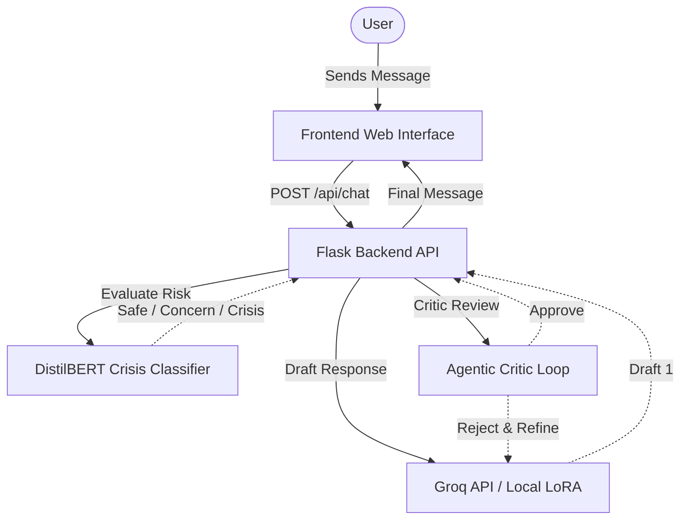
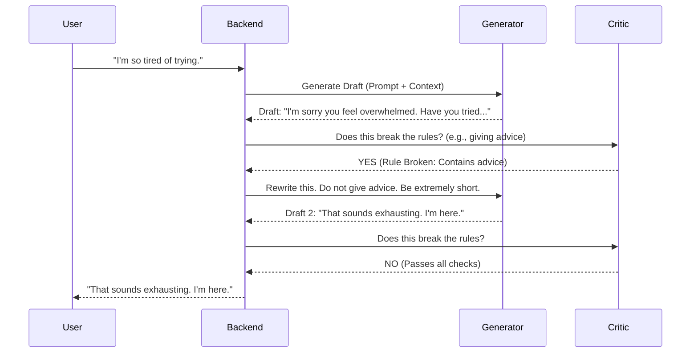

# Hearth Companion Architecture

Hearth is an emotionally intelligent AI companion built around a strong Agentic Self-Correction Loop and a robust crisis classification mechanism.

## System Architecture

The application is structured into the following main components:
- **Frontend**: A modern glassmorphic web interface.
- **Backend API (Flask)**: Serves the web UI and handles chat generation.
- **LLM Engine (Groq / LoRA)**: Handles text generation.
- **Crisis Classifier**: A parallel DistilBERT model detecting distress signals instantly.

## The Agentic Loop

The core innovation of Hearth is its internal "Draft -> Critic -> Refine" loop. This prevents the typical "helpful assistant" persona of base models from leaking through.

## Crisis Classifier

Because LLMs can hallucinate or handle high-risk situations poorly, Hearth uses an independent DistilBERT classifier. 
- It is incredibly fast (< 50ms).
- It overrides the standard prompt logic if a crisis is detected.
- It operates completely outside the LLM reasoning layers.
